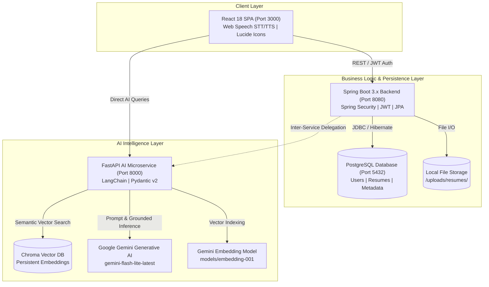
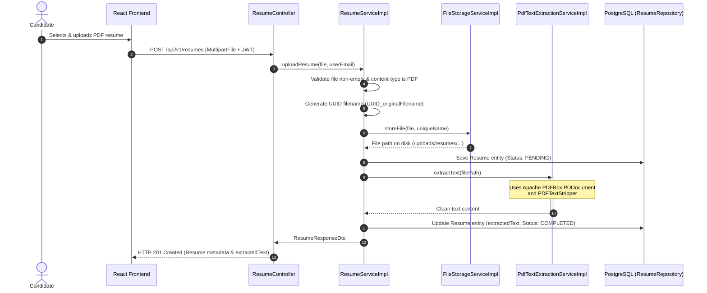
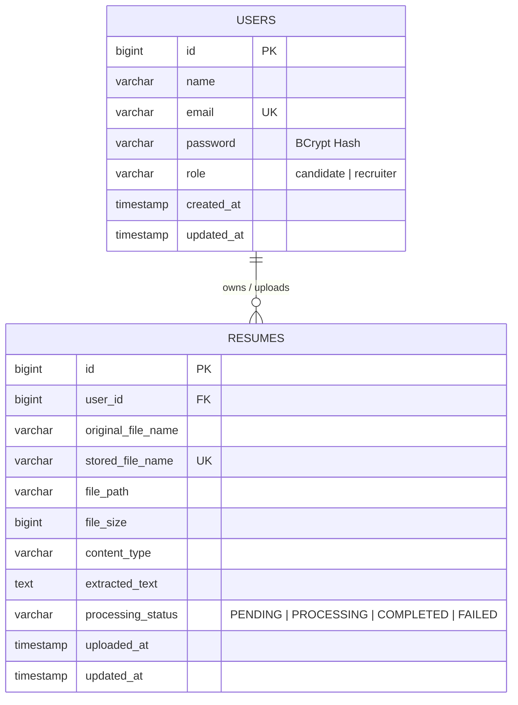
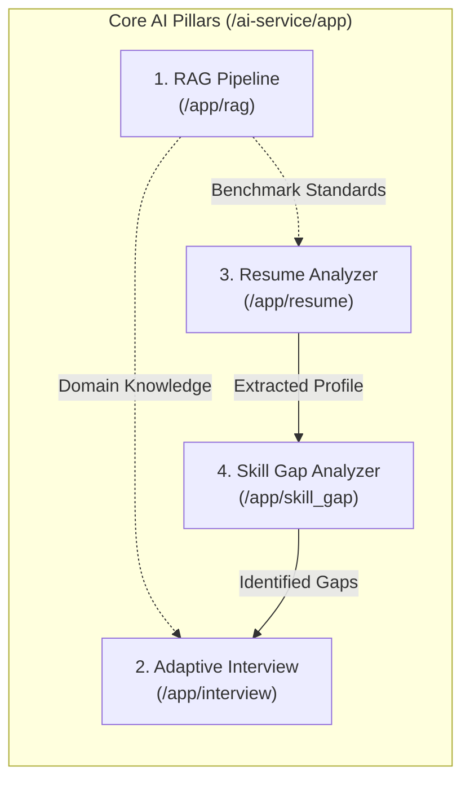
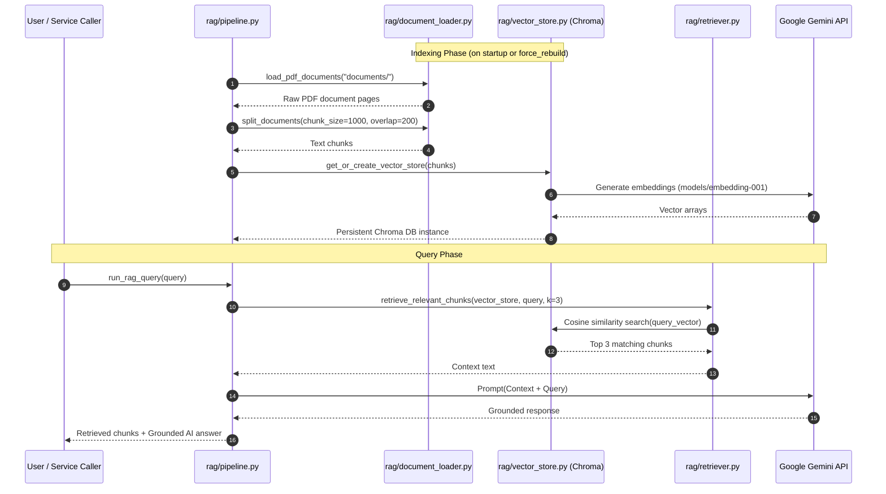
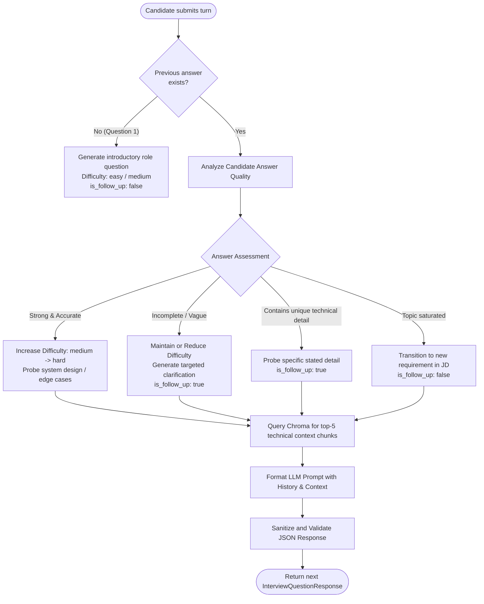
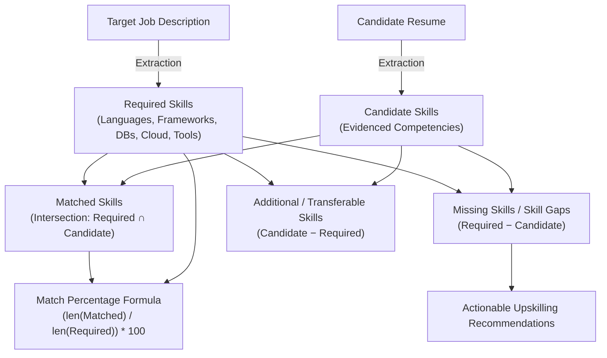
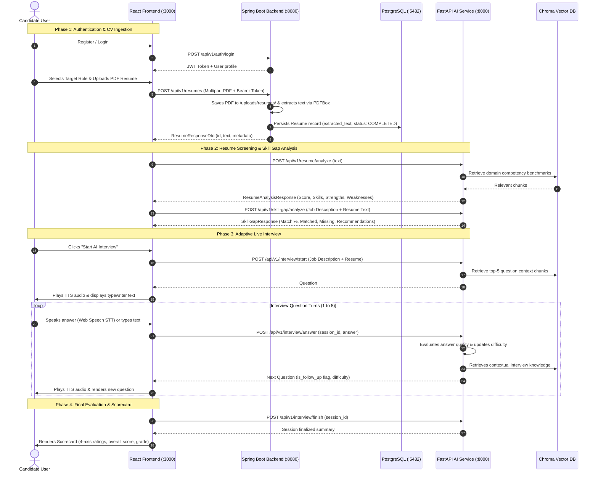

# 🏛️ AI CV Analysis & Adaptive Technical Interview Platform
## Comprehensive Project Structure, Microservices Architecture & AI Engine Specification

> **Course / Project Reference**: CSS3223 Project — AI-Powered CV Analysis & Adaptive Interview System  
> **System Status**: Multi-tier Microservices Platform (React Frontend + Spring Boot Backend + Python FastAPI AI Microservice + PostgreSQL + Chroma Vector DB + Google Gemini 1.5/Flash-Lite)

---

## 📑 Table of Contents

1. [Executive Overview & System Architecture](#1-executive-overview--system-architecture)
2. [Global Repository Structure](#2-global-repository-structure)
3. [Frontend Architecture (`/frontend`)](#3-frontend-architecture-frontend)
   - [3.1 Tech Stack & UI Principles](#31-tech-stack--ui-principles)
   - [3.2 Directory & Component Organization](#32-directory--component-organization)
   - [3.3 Core Pages & User Experiences](#33-core-pages--user-experiences)
   - [3.4 API Integration Layer (`api.js`)](#34-api-integration-layer-apijs)
4. [Backend Architecture (`/backend`)](#4-backend-architecture-backend)
   - [4.1 Tech Stack & Design Patterns](#41-tech-stack--design-patterns)
   - [4.2 Package Structure & Class Breakdown](#42-package-structure--class-breakdown)
   - [4.3 Security & JWT Authentication Engine](#43-security--jwt-authentication-engine)
   - [4.4 Resume Ingestion & PDF Extraction Service](#44-resume-ingestion--pdf-extraction-service)
   - [4.5 Database Relational Schema](#45-database-relational-schema)
5. [AI Microservice Architecture (`/ai-service`)](#5-ai-microservice-architecture-ai-service)
   - [5.1 Tech Stack & AI Ecosystem](#51-tech-stack--ai-ecosystem)
   - [5.2 FastAPI Gateway & REST Controller](#52-fastapi-gateway--rest-controller)
6. [Deep-Dive: The Four Core AI Pillars](#6-deep-dive-the-four-core-ai-pillars)
   - [6.1 Retrieval-Augmented Generation (RAG)](#61-retrieval-augmented-generation-rag)
   - [6.2 Dynamic & Adaptive Technical Interview Engine](#62-dynamic--adaptive-technical-interview-engine)
   - [6.3 Resume / CV Semantic Intelligence Analyzer](#63-resume--cv-semantic-intelligence-analyzer)
   - [6.4 Skill Gap Analysis & Upskilling Roadmap Engine](#64-skill-gap-analysis--upskilling-roadmap-engine)
7. [Cross-Cutting Communication & Sequence Flows](#7-cross-cutting-communication--sequence-flows)
8. [Environment Setup, Docker & Execution Guide](#8-environment-setup-docker--execution-guide)
9. [Future Roadmap & Architectural Enhancements](#9-future-roadmap--architectural-enhancements)

---

## 1. Executive Overview & System Architecture

The **AI CV Analysis & Adaptive Technical Interview Platform** is an enterprise-grade, distributed AI solution designed to revolutionize the modern technical recruitment process. It addresses key hiring pain points: manual resume screening, static and unchallenging interview questionnaires, inaccurate candidate-job matching, and subjective candidate scorecards.

The platform provides a dual-interface system for:
1. **Candidates**: Uploading CVs in PDF format, receiving instant AI-driven resume scoring, performing job-specific skill gap evaluations, participating in live, voice-enabled adaptive interviews with dynamic AI interviewers, and viewing multi-axis evaluation scorecards.
2. **Recruiters**: Managing open job descriptions, tracking candidate interview completion states, and inspecting granular performance analytics.



### Key Architectural Characteristics
- **Separation of Concerns**: Business identity, persistence, and file management are handled by **Java Spring Boot 3**, while deep language understanding, semantic search, and LLM reasoning are delegated to **Python FastAPI**.
- **Dual Vector & Relational Storage**: PostgreSQL manages relational data (users, role authorizations, file metadata, text extracts), while Chroma DB stores vector embeddings of documents for RAG context retrieval.
- **Adaptive Intelligence**: The interview generator does not select from a static list of questions; it continuously monitors the candidate's prior responses, adjusting question difficulty (easy, medium, hard) and detecting when to ask deep technical follow-ups.

---

## 2. Global Repository Structure

```
CSS3223_Project_AI-CV-Analysis-System/
├── .env.example                     # Root environment configuration reference
├── .gitignore                       # Git ignore rules for node, python, maven, logs
├── docker-compose.yml               # Multi-container orchestration (PostgreSQL, Spring Boot, FastAPI, React)
├── Dockerfile                       # Container definition for containerized backend services
├── ARCHITECTURE.md                  # High-level architecture summary
├── PROJECT_PLAN.md                  # Project milestones and delivery phases
├── README.md                        # Project landing readme
│
├── frontend/                        # React 18 Single Page Application
│   ├── package.json                 # Node dependencies (lucide-react, react-router-dom v7)
│   ├── public/                      # Static assets and HTML template
│   └── src/
│       ├── App.jsx                  # Main route switch and session provider
│       ├── index.js                 # React DOM root mounting
│       ├── index.css                # Global design system & theme variables
│       ├── components/              # Shared UI components (Navbar, Footer)
│       ├── pages/                   # Application views (Landing, Auth, CVUpload, SkillGap, InterviewRoom, Scorecard, Dashboard)
│       └── services/                # Unified REST API client (api.js)
│
├── backend/                         # Java 17 + Spring Boot 3 Core Backend Service
│   ├── pom.xml                      # Maven configuration (Security, JPA, PostgreSQL, JJWT, PDFBox)
│   ├── .env.example                 # Environment variables template for DB and JWT
│   ├── uploads/                     # File upload directory for candidate PDF resumes
│   └── src/
│       ├── main/
│       │   ├── java/com/aiinterview/
│       │   │   ├── AiInterviewApplication.java  # Spring Boot application entrypoint
│       │   │   ├── config/                      # SecurityConfig, CorsConfig
│       │   │   ├── controller/                  # AuthController, ResumeController, HealthController
│       │   │   ├── dto/                         # Request & Response payload transfer objects
│       │   │   ├── entity/                      # User and Resume JPA Entities
│       │   │   ├── exception/                   # Custom exceptions & GlobalExceptionHandler
│       │   │   ├── repository/                  # Spring Data JPA repositories
│       │   │   ├── security/                    # JWT filter, JwtService, UserDetailsService
│       │   │   └── service/                     # Business interfaces & implementations (Auth, File, PDF, Resume)
│       │   └── resources/
│       │       └── application.yml              # Database, JWT, multipart, and service configurations
│       └── test/                                # JUnit & Mockito unit/integration test suites
│
├── ai-service/                      # Python 3.11 + FastAPI AI Microservice
│   ├── requirements.txt             # Python libraries (fastapi, uvicorn, langchain, langchain-google-genai, chromadb)
│   ├── .env.example                 # Environment variables template (GEMINI_API_KEY)
│   ├── chroma_db/                   # Persistent Chroma vector store files
│   ├── documents/                   # Knowledge base directory for ingested reference PDFs
│   ├── main.py                      # Standalone CLI runner / alternate launcher
│   └── app/
│       ├── __init__.py              # Application package marker
│       ├── main.py                  # FastAPI REST API entrypoint & route orchestrator
│       ├── rag/                     # Retrieval-Augmented Generation module
│       │   ├── document_loader.py   # PDF loading & recursive text chunking
│       │   ├── embeddings.py        # Gemini embedding model wrapper
│       │   ├── vector_store.py      # Chroma vector DB manager
│       │   ├── retriever.py         # Top-k similarity retriever
│       │   └── pipeline.py          # Grounded LangChain RAG pipeline & CLI runner
│       ├── interview/               # Adaptive Interview Generation module
│       │   ├── schemas.py           # Pydantic request & response models
│       │   ├── session_manager.py   # In-memory interview session state holder
│       │   ├── question_generator.py# RAG-infused adaptive question generation engine
│       │   └── routes.py            # Interview router definitions
│       ├── resume/                  # Resume Analysis module
│       │   ├── schemas.py           # Experience, Education, Analysis schemas
│       │   └── analyzer.py          # Structured Gemini resume extraction & scoring
│       └── skill_gap/               # Skill Gap Analysis module
│           ├── schemas.py           # Skill gap request & response models
│           └── analyzer.py          # Differential matching & recommendation engine
│
├── docs/                            # System and Architectural Documentation
│   ├── API_SPECIFICATION.md         # Inter-service REST endpoint contract
│   └── PROJECT_STRUCTURE_AND_ARCHITECTURE.md # This comprehensive document
│
└── tests/                           # Integration and proctoring test artifacts
```

---

## 3. Frontend Architecture (`/frontend`)

### 3.1 Tech Stack & UI Principles
- **Library / Runtime**: React 18.2.0 initialized with `react-scripts 5.0.1`.
- **Routing**: `react-router-dom` v7.18.2 with client-side protected route guards.
- **Iconography**: `lucide-react` for streamlined modern SVG glyphs.
- **Audio / Voice APIs**: Native browser **Web Speech API**:
  - `SpeechRecognition` / `webkitSpeechRecognition` for candidate speech-to-text (STT).
  - `window.speechSynthesis` (`SpeechSynthesisUtterance`) for voice question playback (TTS).
- **Styling Architecture**: Tailored Vanilla CSS3 design system defined in `src/index.css`.
  - Curated Color Palette:
    - Background Primary: Deep Navy `#213555`
    - Card / Surface Navy: Accent Steel `#3E5879`
    - Primary Accent / Gold Highlight: Warm Sand `#D8C4B6`
    - Text Primary / High-Contrast Off-White: Parchment `#F5EFE7`
  - Glassmorphic card surfaces, gradient borders, dynamic waveform indicators, and typewriter text animation effects.

### 3.2 Directory & Component Organization

```
frontend/src/
├── App.jsx                     # Top-level application shell with auth state management
├── index.js                    # React 18 root mounting
├── index.css                   # Global styling tokens, CSS variables, utility classes
├── components/
│   ├── Navbar.jsx              # Responsive header, role indicator, navigation links, logout
│   └── Footer.jsx              # System footer with links and platform branding
├── pages/
│   ├── Landing.jsx             # Public landing page with hero CTA and feature cards
│   ├── Login.jsx               # Candidate / Recruiter authentication form
│   ├── Register.jsx            # Account creation form with role selector
│   ├── CVUpload.jsx            # Multi-step Step 1: PDF resume upload & initial AI breakdown
│   ├── SkillGap.jsx            # Multi-step Step 2: Interactive job vs. resume gap analysis
│   ├── InterviewRoom.jsx       # Multi-step Step 3: Voice-enabled live adaptive interview session
│   ├── Scorecard.jsx           # Post-interview multi-axis evaluation scorecard
│   └── RecruiterDashboard.jsx  # Recruiter analytics, candidate list, and detailed drill-down
└── services/
    └── api.js                  # Axios/Fetch client connecting to Spring Boot & FastAPI
```

### 3.3 Core Pages & User Experiences

#### 1. Landing View (`Landing.jsx`)
Features a high-impact hero header explaining the platform's value proposition: automated CV screening, deep skill gap analysis, and realistic AI-driven technical interviews. Contains intelligent CTAs that route candidates to `/upload` and recruiters to `/dashboard`.

#### 2. Authentication Views (`Login.jsx`, `Register.jsx`)
Enables registration and login with roles (`candidate` or `recruiter`). Upon successful authentication, the JSON Web Token (`token`) and sanitized user object (`user`) are saved in `localStorage`, maintaining persistent session state across page refreshes.

#### 3. Step 1: CV Upload & Analysis (`CVUpload.jsx`)
- Provides a drag-and-drop zone with instant PDF format validation.
- Allows candidates to select from preset industry roles (Full Stack, Backend, DevOps, Data Science, etc.) or input a custom target position.
- Uploads the physical PDF file to the Spring Boot backend (`POST /api/v1/resumes`) to trigger server-side storage and Apache PDFBox text extraction.
- Immediately passes the extracted resume text to the FastAPI AI service (`POST /api/v1/resume/analyze`).
- Displays a visual summary of the candidate's skills, overall readiness score, strengths, and weaknesses before advancing.

#### 4. Step 2: Skill Gap Analysis (`SkillGap.jsx`)
- Automatically populated with the extracted resume text and default job description based on the role chosen in Step 1.
- Allows candidate customization of the target job description.
- Invokes `POST /api/v1/skill-gap/analyze` on the FastAPI microservice.
- Displays:
  - Visual Match Percentage Gauge (Color-coded: Green $\ge 70\%$, Amber $45-69\%$, Red $<45\%$).
  - Two-column skill audit: **Matched Skills** (green badges) vs. **Missing Skills / Gaps** (red badges).
  - Highlighting of **Additional / Transferable Skills** (blue badges).
  - Targeted upskilling recommendations.
- Provides a "Proceed to Interview" button carrying context forward into the live interview simulator.

#### 5. Step 3: Live Interview Room (`InterviewRoom.jsx`)
- Initializes an adaptive interview session via `POST /api/v1/interview/start`.
- Displays dynamic questions with a **typewriter effect** (progressive character reveal at 22ms intervals).
- **Speech Synthesis (TTS)**: Automatically speaks the interview question aloud using natural browser speech voices.
- **Voice Recognition (STT)**: Activates browser microphone using `webkitSpeechRecognition`, providing live visual waveform indicators and streaming transcribed speech directly into the answer buffer.
- **Countdown Timer**: 120-second active turn timer with warning colors as expiration approaches.
- On answer submission (`POST /api/v1/interview/answer`), sends the transcript to the AI service, which returns an adaptively chosen follow-up or next-level question.
- Upon completing all questions, completes session via `POST /api/v1/interview/finish` and navigates to the Scorecard.

#### 6. Candidate Scorecard (`Scorecard.jsx`)
- Generates a holistic evaluation report with an **Overall Performance Score** (0–100) and grade assignment (e.g., *Excellent*, *Good*, *Average*).
- Displays 4-axis performance radar/progress bars:
  1. **Technical Knowledge**
  2. **Communication Clarity**
  3. **Problem Solving & Logic**
  4. **Cultural & Professional Fit**
- Curates key strengths and critical areas for improvement with actionable interview tips.

#### 7. Recruiter Dashboard (`RecruiterDashboard.jsx`)
- Provides high-level metrics: Total Candidates, Completed Sessions, Average Cohort Score, Active In-Progress Sessions.
- Filterable and searchable candidate table displaying names, target roles, interview status, completion date, and scores.
- Modal inspection allowing recruiters to review individual candidate 4-axis metrics and feedback.

### 3.4 API Integration Layer (`api.js`)

The frontend abstracts all network communication in `src/services/api.js`, cleanly splitting traffic between the Spring Boot business backend and the Python AI service:

| API Object | Target Microservice | Route | Responsibility |
| :--- | :--- | :--- | :--- |
| `authAPI.register` | Spring Boot (`:8080`) | `POST /api/v1/auth/register` | Creates user account with BCrypt password hashing |
| `authAPI.login` | Spring Boot (`:8080`) | `POST /api/v1/auth/login` | Validates credentials and returns JWT Bearer token |
| `resumeAPI.upload` | Spring Boot (`:8080`) | `POST /api/v1/resumes` | Multipart file upload, disk storage, and PDFBox extraction |
| `resumeAPI.getAll` | Spring Boot (`:8080`) | `GET /api/v1/resumes` | Retrieves authenticated user's uploaded resumes |
| `resumeAPI.getById` | Spring Boot (`:8080`) | `GET /api/v1/resumes/{id}` | Retrieves single resume metadata and text |
| `resumeAPI.delete` | Spring Boot (`:8080`) | `DELETE /api/v1/resumes/{id}` | Removes resume record and deletes file from disk |
| `aiResumeAPI.analyze` | FastAPI (`:8000`) | `POST /api/v1/resume/analyze` | LangChain + Gemini deep resume analysis |
| `interviewAPI.start` | FastAPI (`:8000`) | `POST /api/v1/interview/start` | Creates session & retrieves question #1 |
| `interviewAPI.submitAnswer` | FastAPI (`:8000`) | `POST /api/v1/interview/answer` | Saves answer, queries RAG, returns next adaptive question |
| `interviewAPI.finish` | FastAPI (`:8000`) | `POST /api/v1/interview/finish` | Finalizes interview session status |
| `skillGapAPI.analyze` | FastAPI (`:8000`) | `POST /api/v1/skill-gap/analyze` | Generates skill matching, gap audit & recommendations |
| `healthAPI.check` | FastAPI (`:8000`) | `GET /health` | Validates AI service availability and Gemini API key status |

---

## 4. Backend Architecture (`/backend`)

### 4.1 Tech Stack & Design Patterns
- **Language & Framework**: Java 17, Spring Boot 3.2+
- **Security Framework**: Spring Security 6 with stateless `SessionCreationPolicy.STATELESS`
- **Data Persistence**: Spring Data JPA with Hibernate ORM
- **Database Engine**: PostgreSQL 15
- **Document Processing**: Apache PDFBox 3.0.1 for high-fidelity text extraction
- **JWT Cryptography**: `io.jsonwebtoken` (JJWT 0.11.5) with HMAC-SHA256
- **Architecture Pattern**: Layered Architecture (Controller $\rightarrow$ Service $\rightarrow$ Repository $\rightarrow$ Database)

### 4.2 Package Structure & Class Breakdown

```
backend/src/main/java/com/aiinterview/
├── AiInterviewApplication.java           # Entrypoint (@SpringBootApplication)
├── config/
│   ├── SecurityConfig.java               # SecurityFilterChain, PasswordEncoder, AuthenticationManager
│   └── CorsConfig.java                   # Cross-Origin Resource Sharing filter mappings
├── controller/
│   ├── AuthController.java               # /api/v1/auth/register & /api/v1/auth/login
│   ├── ResumeController.java             # /api/v1/resumes (Upload, List, Get, Delete)
│   └── HealthController.java             # /api/v1/health status endpoint
├── dto/
│   ├── AuthResponse.java                 # JWT token and UserDto response
│   ├── ErrorResponse.java                # Standard error response body
│   ├── LoginRequest.java                 # Email and password payload
│   ├── RegisterRequest.java              # Name, email, password, role payload
│   ├── ResumeResponseDto.java            # Resume metadata, status, and extracted text
│   └── UserDto.java                      # Safe user presentation model (excluding password)
├── entity/
│   ├── User.java                         # JPA Entity for 'users' table
│   └── Resume.java                       # JPA Entity for 'resumes' table
├── exception/
│   ├── DuplicateEmailException.java      # HTTP 409 Conflict trigger
│   ├── GlobalExceptionHandler.java       # Centralized @RestControllerAdvice exception handler
│   ├── InvalidFileException.java         # HTTP 400 Bad Request for invalid file uploads
│   ├── ResourceNotFoundException.java    # HTTP 404 Not Found trigger
│   └── UnauthorizedAccessException.java  # HTTP 403 Forbidden trigger
├── repository/
│   ├── UserRepository.java               # JpaRepository<User, Long>
│   └── ResumeRepository.java             # JpaRepository<Resume, Long>
├── security/
│   ├── CustomUserDetailsService.java     # UserDetailsService implementation loading by email
│   ├── JwtAuthenticationFilter.java      # OncePerRequestFilter extracting Bearer tokens
│   └── JwtService.java                   # Token generation, claims extraction, signature verification
└── service/
    ├── AuthService.java                  # Registration and login contract
    ├── FileStorageService.java           # Filesystem storage and deletion contract
    ├── PdfTextExtractionService.java     # PDF text extraction contract
    ├── ResumeService.java                # Resume lifecycle orchestration contract
    └── impl/
        ├── AuthServiceImpl.java          # User validation, BCrypt encoding, JWT issuance
        ├── FileStorageServiceImpl.java   # Local disk read/write with UUID file protection
        ├── PdfTextExtractionServiceImpl.java # Apache PDFBox extraction implementation
        └── ResumeServiceImpl.java        # Ingestion workflow, persistence, and authorization
```

### 4.3 Security & JWT Authentication Engine

1. **Password Encryption**: All passwords undergo salted one-way hashing using `BCryptPasswordEncoder` with strength 10. Raw passwords are never stored in the database or serialized in responses.
2. **Stateless Authorization Filter**:
   - `JwtAuthenticationFilter` intercepts incoming HTTP requests.
   - Parses the `Authorization` header looking for the `Bearer <token>` scheme.
   - Calls `JwtService.extractUsername(token)` to retrieve the subject claim (`email`).
   - Verifies the signature using the 256-bit secret key and checks that `expiration > System.currentTimeMillis()`.
   - Populates Spring Security's `SecurityContextHolder.getContext().setAuthentication(...)` with an authenticated `UsernamePasswordAuthenticationToken`.
3. **Protected Endpoints**:
   - Public: `/api/v1/auth/**`, `/api/v1/health`, Swagger/OpenAPI endpoints.
   - Authenticated: `/api/v1/resumes/**` and all subsequent candidate operations.

### 4.4 Resume Ingestion & PDF Extraction Service

The resume ingestion pipeline in `ResumeServiceImpl.java` performs a reliable 9-step sequence:



### 4.5 Database Relational Schema



---

## 5. AI Microservice Architecture (`/ai-service`)

### 5.1 Tech Stack & AI Ecosystem
- **Web Framework**: Python 3.11 with **FastAPI 0.109+** and **Uvicorn** ASGI server.
- **LLM Orchestration**: **LangChain** (`langchain`, `langchain-core`, `langchain-community`).
- **Foundational LLM**: **Google Gemini** (`gemini-flash-lite-latest` / `gemini-1.5-flash`) via `langchain-google-genai`.
- **Vector Database**: **Chroma DB** (`chromadb 0.4.22+`) with local persistent storage on disk.
- **Embedding Model**: Google Generative AI Embeddings (`models/embedding-001`).
- **Data Validation & Typing**: **Pydantic v2** (`BaseModel`, `Field`).

### 5.2 FastAPI Gateway & REST Controller

`ai-service/app/main.py` serves as the centralized HTTP gateway. It handles:
- **CORS Middleware**: Allows cross-origin requests from the React frontend (`localhost:3000`) and Spring Boot backend (`localhost:8080`).
- **Validation**: Enforces non-empty payloads, valid string lengths, and proper data types via Pydantic schemas.
- **Environment Verification**: Verifies presence of `GEMINI_API_KEY` before dispatching requests to LLM chains.
- **Error Formatting**: Catches and translates internal failures into structured HTTP 400 or HTTP 500 error responses.

---

## 6. Deep-Dive: The Four Core AI Pillars

The platform's intelligent features are built on four dedicated AI pillars:



---

### 6.1 Retrieval-Augmented Generation (RAG)

#### Purpose
Prevents hallucinations and grounds technical evaluation in official source material (job specifications, technical competencies, company hiring rubrics, and engineering standards). The RAG pipeline ensures that question generation and candidate evaluations are backed by real domain knowledge.

#### Module Breakdown (`ai-service/app/rag/`)

| File | Primary Functions / Classes | Responsibility |
| :--- | :--- | :--- |
| `document_loader.py` | `load_pdf_documents(folder_path)`<br/>`split_documents(documents, chunk_size, chunk_overlap)` | Uses `PyPDFLoader` to parse PDFs in `documents/`. Applies `RecursiveCharacterTextSplitter` with `chunk_size=1000` and `chunk_overlap=200` to preserve context across chunk boundaries. |
| `embeddings.py` | `get_embeddings()` | Initializes and returns `GoogleGenerativeAIEmbeddings` using `models/embedding-001` and the configured `GEMINI_API_KEY`. |
| `vector_store.py` | `get_or_create_vector_store(documents, persist_dir, force_rebuild)` | Manages local persistent Chroma DB in `ai-service/chroma_db/`. Rebuilds collection when `force_rebuild=True` or returns existing instance. |
| `retriever.py` | `get_similarity_retriever(vector_store, k=3)`<br/>`retrieve_relevant_chunks(...)` | Configures vector similarity search returning top-$k$ most relevant document chunks based on cosine distance. |
| `pipeline.py` | `build_rag_chain(vector_store)`<br/>`run_rag_query(query, ...)`<br/>`main_cli()` | Assembles the LangChain Expression Language (LCEL) chain, enforces strict anti-hallucination prompt, executes queries, and provides an interactive CLI test runner. |

#### RAG Execution Workflow



#### Grounding & Anti-Hallucination Guardrails
The prompt in `pipeline.py` enforces strict grounding:
```text
You are an objective AI Interview & Knowledge Assistant.
Answer the user's question ONLY using the provided context below.
If the answer cannot be found or inferred from the provided context, state clearly:
"The requested information is not available in the knowledge base."
Do NOT use any outside knowledge or make up information.
```

---

### 6.2 Dynamic & Adaptive Technical Interview Engine

#### Purpose
Replaces static question lists with an adaptive technical interviewer that evaluates candidate responses in real time, dynamically scales difficulty up or down, and probes for deeper technical understanding through follow-up questions.

#### Module Breakdown (`ai-service/app/interview/`)

| File | Primary Functions / Classes | Responsibility |
| :--- | :--- | :--- |
| `session_manager.py` | `InterviewSession`<br/>`create_session(...)`<br/>`get_session(...)`<br/>`add_question(...)`<br/>`add_answer(...)`<br/>`finish_session(...)` | Manages in-memory interview session state: tracks unique `session_id`, job description, candidate resume text, question history, candidate answer turns, and active/completed status. |
| `schemas.py` | `InterviewStartRequest/Response`<br/>`InterviewAnswerRequest/Response`<br/>`InterviewQuestionRequest/Response`<br/>`InterviewFinishRequest/Response` | Defines validated Pydantic data transfer schemas for every stage of an interview turn. |
| `question_generator.py` | `generate_next_question(request)`<br/>`_clean_json_response(text)`<br/>`_get_llm()` | Synthesizes context, queries Chroma DB for relevant technical knowledge, invokes Gemini with adaptive prompt, and enforces clean JSON extraction. |
| `routes.py` | FastAPI APIRouter | Exposes modular sub-routes for interview workflows. |

#### Adaptive Question Logic & Decision Matrix
The interview generator operates under a structured decision matrix:



#### JSON Output Contract
The model is strictly constrained to output valid JSON matching this schema:
```json
{
  "question": "Could you walk through how you would handle distributed transaction rollback across microservices?",
  "category": "Distributed Systems",
  "difficulty": "hard",
  "is_follow_up": true,
  "reason": "Candidate correctly explained the Saga pattern in their previous answer; this tests their understanding of compensating transactions."
}
```

---

### 6.3 Resume / CV Semantic Intelligence Analyzer

#### Purpose
Automates resume screening by converting unstructured PDF resumes into structured, validated candidate profiles with evidence-based scoring and feedback.

#### Module Breakdown (`ai-service/app/resume/`)

| File | Primary Functions / Classes | Responsibility |
| :--- | :--- | :--- |
| `schemas.py` | `ResumeAnalysisRequest`<br/>`ResumeAnalysisResponse`<br/>`ExperienceItem`<br/>`EducationItem` | Validates extracted text input ($\ge 20$ chars) and models structured candidate analysis results. |
| `analyzer.py` | `analyze_resume(resume_id, resume_text)`<br/>`_clean_json_response(text)`<br/>`_parse_experience(...)`<br/>`_parse_education(...)` | Queries Chroma for benchmark criteria, invokes Gemini with the resume analysis prompt, cleans JSON output, and safely parses structured fields. |

#### Analysis Dimensions
1. **Readiness Score (0–100)**: Evaluates candidate experience depth, technical breadth, and project impact.
2. **Executive Summary**: A concise professional profile synthesized from verified experience.
3. **Explicitly Evidenced Skills**: List of skills directly corroborated by the resume (no hallucinations).
4. **Structured Work Experience**: List of parsed roles containing `company`, `role`, `duration`, and `description`.
5. **Structured Education**: Academic qualifications including `institution`, `degree`, `field`, and `year`.
6. **Strengths & Weaknesses**: Evidence-backed assessment of candidate advantages and potential gaps.
7. **Missing Market Competencies**: Identifies key skills absent from the resume based on knowledge base standards.
8. **Practical Recommendations**: Actionable suggestions to improve candidate readiness and presentation.

---

### 6.4 Skill Gap Analysis & Upskilling Roadmap Engine

#### Purpose
Performs automated gap analysis between a candidate's resume and a target job description, identifying exact skill matches, critical deficiencies, and personalized upskilling pathways.

#### Module Breakdown (`ai-service/app/skill_gap/`)

| File | Primary Functions / Classes | Responsibility |
| :--- | :--- | :--- |
| `schemas.py` | `SkillGapRequest`<br/>`SkillGapResponse` | Models the dual input (Job Description + Candidate Resume) and structured gap output. |
| `analyzer.py` | `analyze_skill_gap(request)`<br/>`_safe_percentage(val)`<br/>`_safe_string_list(val)` | Extracts skills from both inputs, calculates match percentage, identifies gaps, and builds upskilling recommendations. |

#### Skill Classification Model



#### Structured Response Schema
```json
{
  "required_skills": ["Java", "Spring Boot", "PostgreSQL", "Docker", "Kubernetes", "Kafka"],
  "candidate_skills": ["Java", "Spring Boot", "PostgreSQL", "React", "Git", "REST APIs"],
  "matched_skills": ["Java", "Spring Boot", "PostgreSQL"],
  "missing_skills": ["Docker", "Kubernetes", "Kafka"],
  "additional_skills": ["React", "Git"],
  "match_percentage": 50,
  "summary": "Candidate matches 3 of 6 core backend requirements with strong Java and Spring fundamentals, but lacks required cloud and streaming experience.",
  "recommendations": [
    "Complete hands-on containerization projects using Docker and multi-stage builds.",
    "Deploy a multi-service architecture on a local Kubernetes cluster using Minikube or Kind.",
    "Implement an event-driven messaging pipeline using Apache Kafka."
  ]
}
```

---

## 7. Cross-Cutting Communication & Sequence Flows

### Complete Candidate Journey Flow



---

## 8. Environment Setup, Docker & Execution Guide

### 8.1 Required Environment Variables

#### Root & Docker Compose (`.env`)
```env
POSTGRES_USER=postgres
POSTGRES_PASSWORD=postgrespassword
POSTGRES_DB=ai_interview_db
GEMINI_API_KEY=your_google_gemini_api_key_here
```

#### Backend Service (`backend/.env` / `application.yml`)
```env
PORT=8080
DB_URL=jdbc:postgresql://localhost:5432/ai_interview_db
DB_USERNAME=postgres
DB_PASSWORD=postgrespassword
JWT_SECRET=404E635266556A586E3272357538782F413F4428472B4B6250645367566B5970
JWT_EXPIRATION_MS=86400000
AI_SERVICE_URL=http://localhost:8000
FILE_UPLOAD_DIR=uploads/resumes/
```

#### AI Microservice (`ai-service/.env`)
```env
GEMINI_API_KEY=your_google_gemini_api_key_here
```

---

### 8.2 Running the Platform Locally (Bare-Metal)

#### Terminal 1: PostgreSQL
Ensure PostgreSQL is running locally on port `5432` with database `ai_interview_db`:
```bash
# Or use Docker for PostgreSQL only:
docker run --name interview_postgres -e POSTGRES_PASSWORD=postgrespassword -e POSTGRES_DB=ai_interview_db -p 5432:5432 -d postgres:15-alpine
```

#### Terminal 2: Spring Boot Backend
```bash
cd backend
./mvnw spring-boot:run
# Backend will start on http://localhost:8080
```

#### Terminal 3: FastAPI AI Microservice
```bash
cd ai-service
# Create and activate virtual environment
python -m venv venv
.\venv\Scripts\Activate.ps1    # On Windows PowerShell
# source venv/bin/activate     # On Linux / macOS

pip install -r requirements.txt
uvicorn app.main:app --reload --port 8000
# AI Microservice will start on http://localhost:8000
# OpenAPI Docs available at: http://localhost:8000/docs
```

#### Terminal 4: React Frontend
```bash
cd frontend
npm install
npm start
# Web app will start on http://localhost:3000
```

---

### 8.3 Running with Docker Compose

To start all four tiers simultaneously in isolated containers:
```bash
# From the project root
docker compose up --build
```

Service mapping:
- **React Frontend**: `http://localhost:3000`
- **Spring Boot Backend**: `http://localhost:8080`
- **FastAPI AI Service**: `http://localhost:8000`
- **PostgreSQL Database**: `localhost:5432`

---

## 9. Future Roadmap & Architectural Enhancements

1. **Persistent Interview State in PostgreSQL**:
   - Transition in-memory interview sessions from `session_manager.py` into persistent PostgreSQL tables (`interview_sessions`, `session_turns`, `evaluations`) via Spring Boot.
2. **Full-Duplex Audio Streaming via WebSockets**:
   - Replace HTTP turn polling with WebSockets to enable streaming speech-to-text and low-latency audio responses.
3. **Automated Proctoring & Integrity Guardrails**:
   - Add browser tab-switching detection, webcam gaze tracking, and secondary device detection.
4. **Multi-Agent Evaluation Panel**:
   - Use LangGraph to run a multi-agent review panel (Technical Lead, HR Manager, System Architect) to generate composite hiring recommendations.
